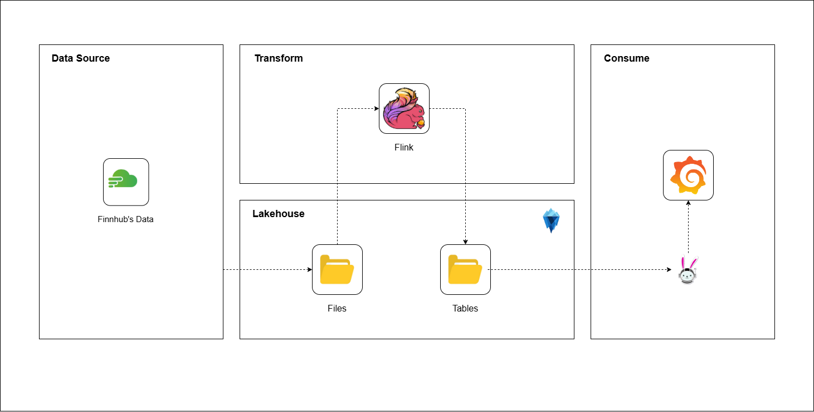
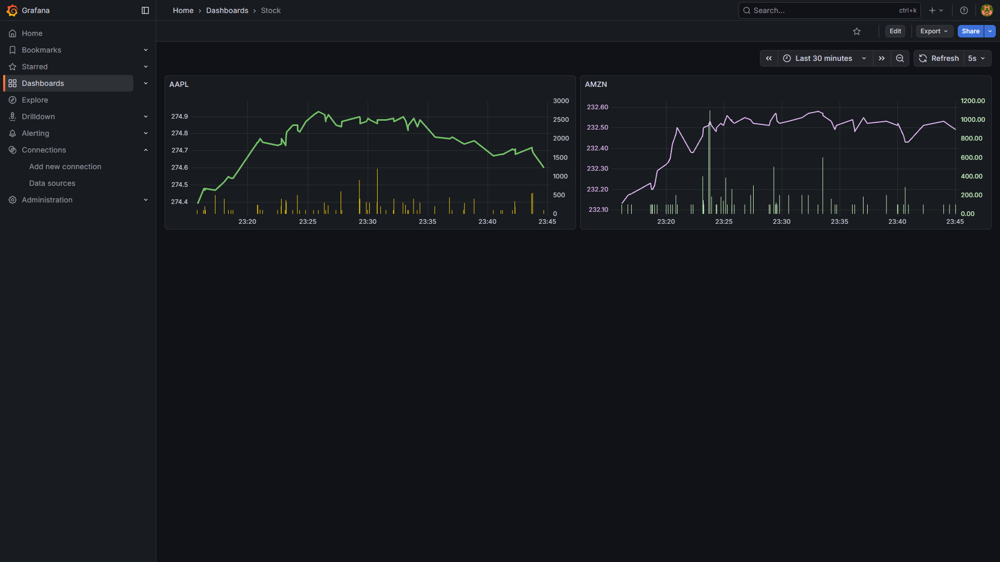

# Finhub Data Pipeline
The project is datapipeline based on Finhub.io's trading APIs/Websocket. 

## Architecture

## Environments
+ `FINNHUB_TOKEN`: your finnhub's token
+ `AWS_ACCESS_KEY_ID`: your AWS access key
+ `AWS_SECRET_ACCESS_KEY`: your AWS secret key
+ `AWS_REGION`: your AWS region
+ `AWS_DEFAULT_REGION`: your AWS default region
+ `S3_ENDPOINT`: your AWS endpoint
+ `S3_PATH_STYLE_ACCESS`: `true` or `false`

## Result

<figure style="text-align: center">
    
    <figcaption >Stock dashboard</figcaption>
</figure>